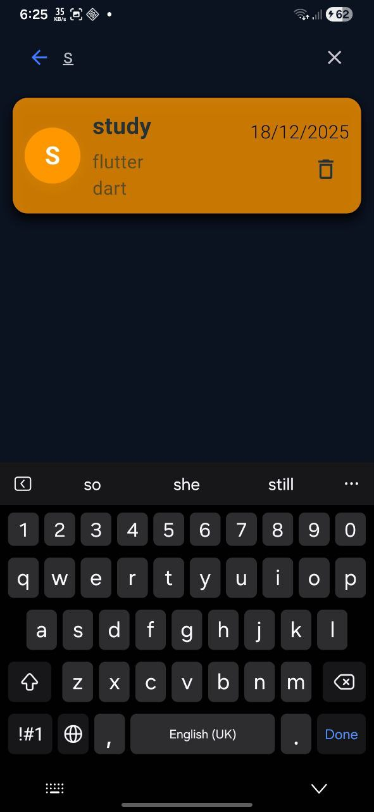
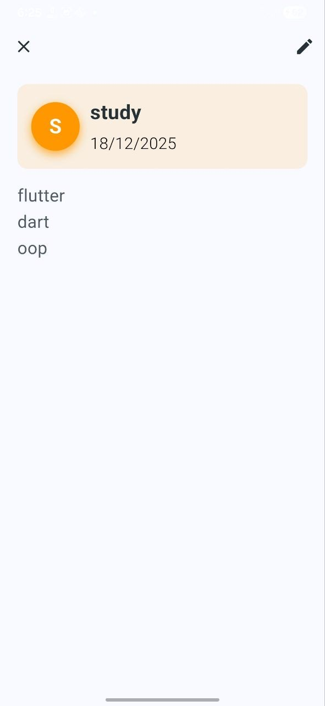
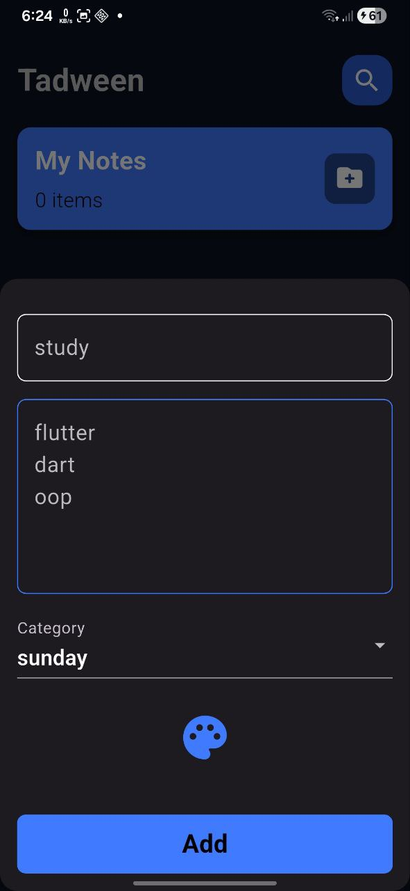
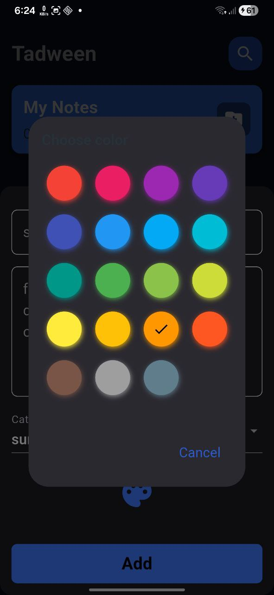
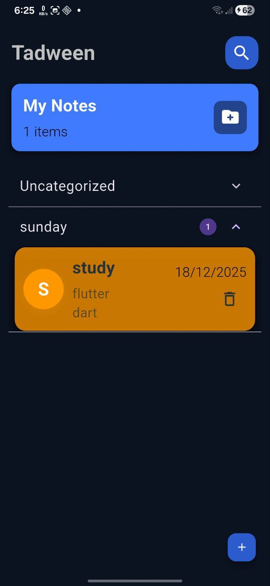
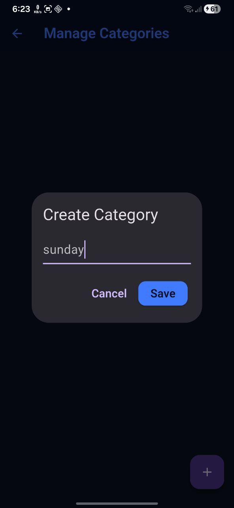

# Tadween 📝

[](https://flutter.dev) [](https://dart.dev) 

A powerful **offline-first note-taking app** built with Flutter. Create, organize, and manage notes with color-coded categories—all stored locally with zero internet dependency.

---

## ✨ Key Features

- 📝 **Rich Notes** - Title, subtitle, timestamp, colors, and categories
- 💾 **100% Offline** - ObjectBox embedded database, zero internet needed
- ⚡ **Lightning Fast** - <50ms database operations, <2s cold start
- 🎨 **Color Organization** - 8+ colors for quick visual identification
- 🔒 **Privacy First** - Your notes never leave your device

---

## 📸 Screenshots

<p align="center">

  
  
  
  
  
  
  

</p>

---

## 🛠️ Tech Stack

- **Flutter & Dart** (^3.10.0)
- **ObjectBox** (^5.0.2) - Local database
- **BLoC/Cubit** - State management
- **ScreenUtil** - Responsive design
- **SharedPreferences** - Onboarding persistence

---

## 🚀 Getting Started

```bash
# Clone repo
git clone https://github.com/m7mdmaken/tadween.git
cd tadween

# Install dependencies
flutter pub get

# Run app
flutter run
```

**Build release:**
```bash
flutter build apk --release 
```

---

## 🏗️ Architecture

Feature-first structure with Clean Architecture principles:

```
lib/
├── core/           # Shared utilities, routing, theme
├── features/
│   ├── on_boarding/   # Onboarding flow
│   └── home/          # Notes CRUD
│       ├── data/models/    # Entities
│       ├── logic/cubits/   # State management
│       └── ui/             # Views & widgets
```

**State Management:** Cubit pattern for clean separation of UI and business logic  
**Database:** ObjectBox for high-performance local storage


---

## 🤝 Contributing

Fork → Branch → Commit → Push → Pull Request

Run `flutter analyze` before submitting. Follow existing code patterns.

---


## 📧 Contact

**Mohamed Ibrahim Almaken**  
Junior Flutter Developer

📧 [m7mdmaken@gmail.com](mailto:m7mdmaken@gmail.com)  
💼 [LinkedIn](https://linkedin.com/in/m7mdmaken)  
🐙 [GitHub](https://github.com/m7mdmaken)  
📱 +201096587177

---

<p align="center">Built with ❤️ using Flutter</p>